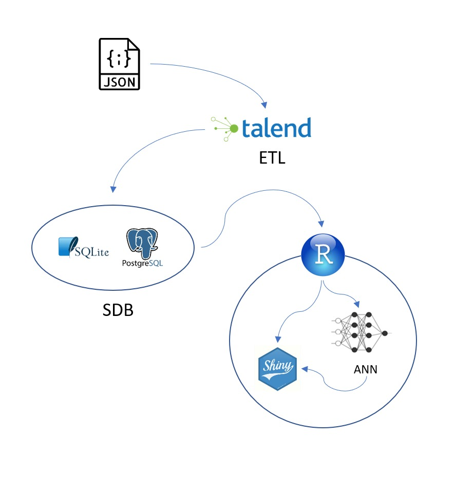

# RaioX

## 1. **Na visão de vocês e referente ao desafio que escolheram qual é o problema que querem solucionar?**
Bem como explicitado no Relato 03 do material de apoio: Relatos de Apoio - Personas, onde a persona especificada “gostaria de ter uma previsão de quanto tempo seu processo irá levar para ter uma decisão,”, e ainda, a baixa informação disponível pelo Judiciário quanto à informações de previsão em geral, o time 33 se propôs, como objetivo principal, desenvolver um método que seja capaz de estimar o tempo médio de julgamento de um processo, dado alguns parâmetros conhecidos da base do Datajud.
E ainda, como forma de complementar e trazer mais informações à Sociedade, o segundo objetivo do time 33 foi de, a partir do Datajud, reconstruir toda a série histórica de Estoque Processual por serventia, permitindo assim, uma análise temporal do fato, tanto para o passado, quanto para futuras predições futuras.

## 2. **O que a solução promete gerar de resultados?**
Assim, com o tempo médio de julgamento do processo dado certos parâmetros e o estoque, entendemos que isso poderá contribuir para: a) planejamento interno e externo entre as partes interessadas a partir da informação do tempo médio de julgamento previsto; b) identificar possíveis gargalos na base avaliando os maiores estoques entre as serventias e os maiores tempos médios de tramitação; c) suportar o processo decisório do Poder Judiciário e das serventias.
A solução gera dois resultados: O primeiro é o tempo médio de julgamento dado parâmetros conhecidos de um processo; e o segundo é a série histórica do Acervo Processual de cada serventia.

## 3. **Quais principais métricas do modelo?**
Portanto o modelo possui duas métricas: O primeiro é um estimador via rede neural do tempo médio do processo até o julgamento, e o segundo, é o estoque processual.
Para tempo de julgamento, foi considerado o tempo entre o primeiro movimento do processo até o primeiro movimento da árvore 193 (SGT-CNJ) - Julgamento. Foi usado primeiro movimento como data de início para a contagem pois: a) a tag dataAjuizamento está claramente inutilizada pela inconsistências da base; b) o movimento 26 - Distribuição não está presente em quantidade suficiente de processos. 
Para medição do Estoque, foi considerado o primeiro movimento (mais antigo) como início do processo, e para a baixa foi considerado os movimentos 22, 246 e 488. Sendo assim, a partir da tag “dataHora” foi reconstruída a série histórica do Estoque processual para cada serventia a partir de 2015. 

## 4. **Desenho da arquitetura do sistema e Fluxo de dados**

## 6. **Instruções de Uso**
* Na aba de previsão do tempo médio dos processos, o usuário imputa os parâmetros e a aplicação retorna o tempo médio de julgamento para o determinado processo.
* Na aba de estoque processual, o usuário seleciona a serventia desejada e a aplicação retorna o estoque atual da serventia, e ainda um gráfico da série histórica da serventia.

**Instalação**

## 7. **Licenças utilizadas**
* Apache (versão 2.0)
* ETL Talend Open Data Integration
* PostgreSQL
* SQLite3
* R (versão 4.0.2)
---
## 8. **Áreas de conhecimento e técnicas envolvidas**
A aplicação abrange conhecimentos em **ETL**, especificamente o uso do *Talend Open DAta Integration*, software open source, com o objetivo de transformar os arquivos .JSON em uma base relacional SQLITE3 (.sdb).
Posteriomente, é exigido conhecimento em **SQL** no sentido de migrar a base .sdb para um banco de dados *PostgreSQL* a fim de servir a aplicação.
Seguindo, a aplicação é desenvolvida no ambiente *R*. É utilizado um banco .sdb para dar suporte ao **Process Mining** dentro do ambiente. Após a mineração de dados, o modelo de **Rede Neural** é treinado usando o pacote *ANN2*. E o front end é suportado pelo pacote *Shinny*, ainda em ambiente *R*. O deploy foi realizado no servidor do *RShinny*.

## Licença

